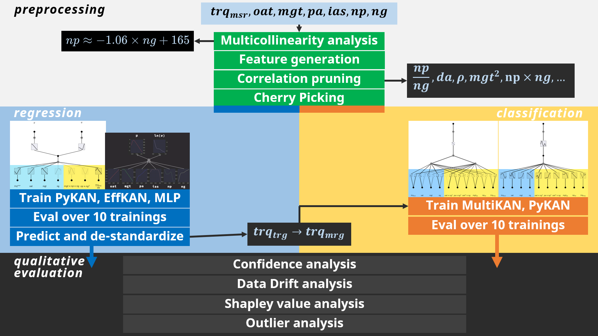

# PHM North America 2024 Challenge
Addressing [PHM North America 2024 Challenge](https://data.phmsociety.org/phm2024-conference-data-challenge/) with [Kolmogorov-Arnold Networks](https://github.com/KindXiaoming/pykan).

## 📙 Slideshows

### 1️⃣ First review [`.PPTX`](https://github.com/user-attachments/files/19043133/Gruppo.A1.prima.revisione.pptx) [`.PDF`](https://github.com/user-attachments/files/19043132/Gruppo.A1.prima.revisione.pdf)
### 2️⃣ Second review [`.PPTX`](https://github.com/user-attachments/files/19074287/Gruppo.A1.seconda.revisione.pptx) [`.PDF`](https://github.com/user-attachments/files/19074286/Gruppo.A1.seconda.revisione.pdf)
### 3️⃣ Third review [`.PPTX`](https://github.com/user-attachments/files/19250163/Gruppo.A1.terza.revisione.pptx) [`.PDF`](https://github.com/user-attachments/files/19250162/Gruppo.A1.terza.revisione.pdf)

## 📙 How this repository is structured

> [!IMPORTANT]  
> Before running the notebooks, make sure to extract the [`\dataset\0-original\dataset.zip`](/dataset/0-original/dataset.zip) archive. Then, you can begin running the notebooks in sequence, starting from [1.1](1-data_preprocessing/1.1-Exploratory_Data_Analysis.ipynb).

    

## 1️⃣ EDA:

#### PCA

  

## 2️⃣ Probabilistic Regression:

#### KANs are interpretable

  
  

#### Torque Target Probabilistic Regression with MLP, non-interpretable. GaussianNLL= -5

  

#### Torque Target Probabilistic Regression with [PyKAN](https://github.com/KindXiaoming/pykan), interpretable. GaussianNLL= -3

  

## 3️⃣ Fault Detection:

#### Binary classification with BCEWithLogitsLoss(pos_weight=2) = 0.18

  
  

